# E-commerce Website Sales and Performance Analysis

**Prepared by:** Yousef Emad  
**Date:** 16/12/2024  

---

## 📝 Executive Summary

This report examines the e-commerce performance of a company headquartered in São Paulo, Brazil, over the past 2–3 years. The primary objectives were to analyze sales trends, understand customer demographics, and identify operational efficiencies. Using Power BI and MySQL Workbench, the findings offer insights into customer behavior, product demand, and geographical sales distribution to guide strategic decision-making for business growth.

---

## 🎯 Project Objectives and Scope

### Objectives:
- Tracking sales performance through KPIs like total revenue, average order value, and customer purchase frequency.
- Analyzing customer demographics and segmentation to inform targeted marketing.
- Identifying product demand patterns by category to support inventory management.
- Assessing operational efficiency metrics, like delivery times and freight costs, to improve service delivery.

### Scope:
The data covers approximately 2–3 years, focusing on general trends across various seasons without specific promotional events.

---

## 📂 Data Sources

The dataset used for this project was sourced from the Brazilian E-commerce Public Dataset available on Kaggle. It features anonymized data from 100,000 orders made between 2016 and 2018 across various marketplaces in Brazil. This rich dataset includes:
- Order status, pricing, and payment details.
- Freight performance and customer locations.
- Product attributes and customer reviews.
### Schema Image

Below is an image representing the data schema, showing how the different tables are connected and organized:

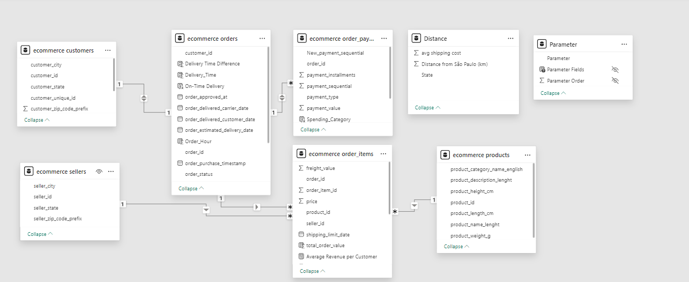

---

## 📂 Data Preparation

### 1. **Data Cleaning and Transformation in Excel**
- **Handling Missing Values:** Missing product names were replaced with "Other."
- **Translation of Product Categories:** Product categories in Portuguese were translated to English using a custom table.
  - Formula used:  
    `=VLOOKUP(B2, product_category_name_translati!$A$2:$B$100, 2, FALSE)`
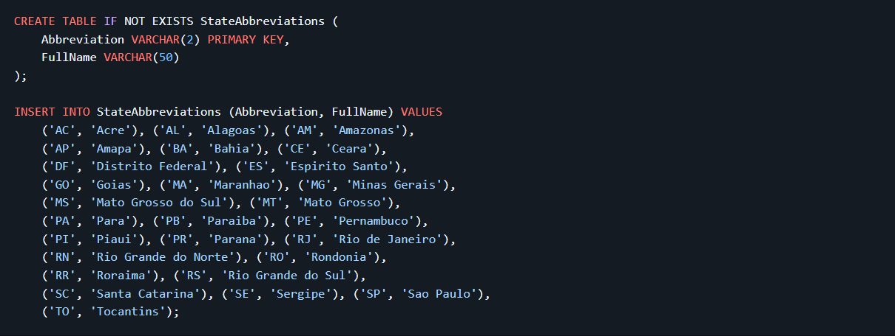
- 1.1**Removing Duplicates and Invalid Records:** Duplicate rows and invalid records were removed.
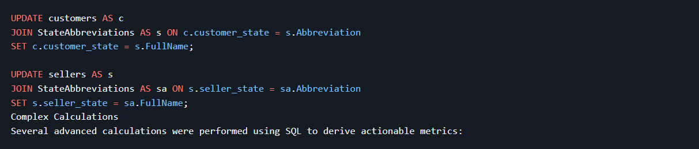
---
### 2. **Transition to SQL for Large-Scale Data Processing**
- **Standardizing State Names:** A `StateAbbreviations` table mapped abbreviations (e.g., "SP") to full names.
- **Delivery Performance Analysis:** Calculated the difference between actual and estimated delivery dates.
- **Customer Segmentation:** Distinguished new vs. returning customers based on order history.
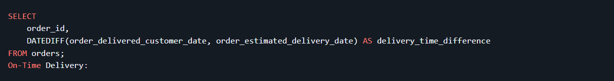
---
### 3. **Overcoming Data Import Challenges with CSV Lint**
The CSV Lint plugin for Notepad++ reduced data import times from hours to seconds, optimizing the workflow for large datasets.
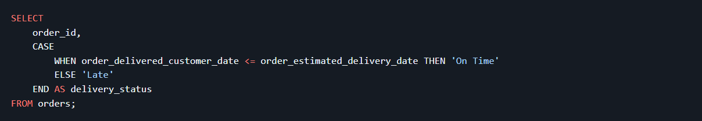
---

## 📈 Visualizations and Insights

### 1. **Sales Performance Analysis**

- **Visuals:** Monthly revenue trends, sales by product category, average revenue per customer.
- **Insights:**
  - Seasonal sales peaks were identified, averaging $136 per customer.
  - "Beauty and Health" emerged as the top-selling category.

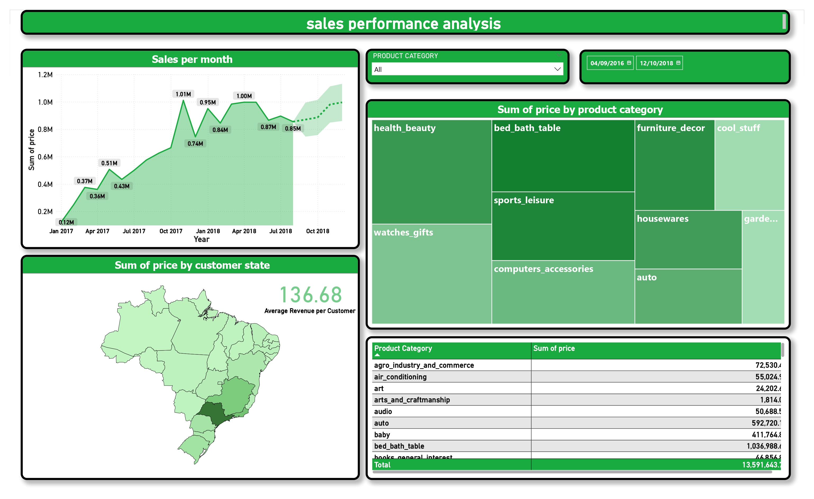
---
### 2. **Geographical Analysis**

- **Visuals:** Total sales and shipping costs by state, average shipping cost by distance.
- **Insights:**
  - São Paulo dominated in sales and seller presence.
  - Shipping costs increase proportionally with distance.

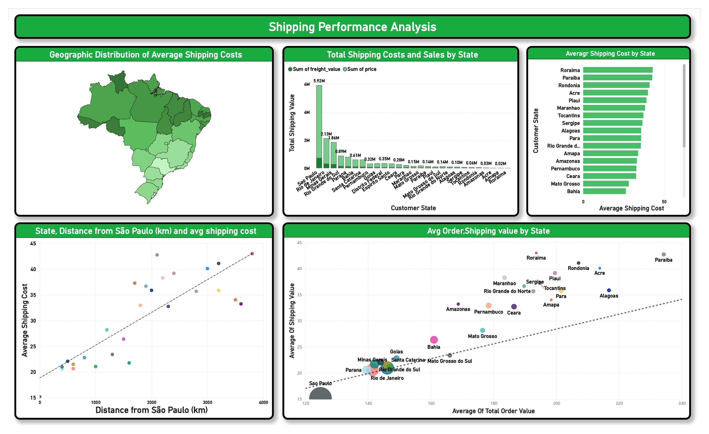
---
### 3. **Order Lifecycle and Delivery Analysis**

- **Visuals:** On-time vs. late deliveries, average delivery times by state.
- **Insights:**
  - 92.13% of orders were delivered on time.
  - Delivery delays were more frequent in states farther from São Paulo.

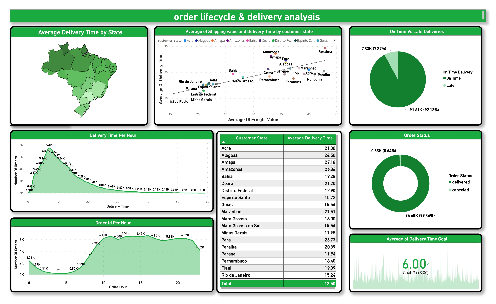
---
### 4. **Customer Insights**

- **Visuals:** New vs. returning customers, payment preferences, customer lifetime value (CLV).
- **Insights:**
  - 93.62% of customers were new, indicating a need for better retention strategies.
  - Credit cards were the most used payment method.

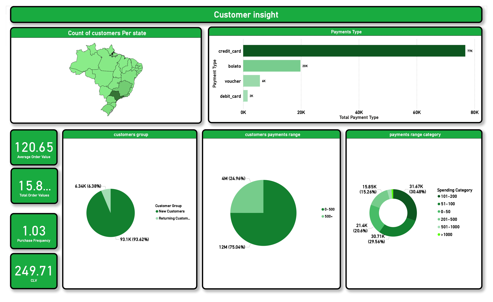
---
### 5. **Seller Insights**

- **Visuals:** Sales performance by seller ID, top-performing sellers.
- **Insights:**
  - Sellers were concentrated in São Paulo and nearby states.
  - A small percentage of sellers contributed to significant sales.

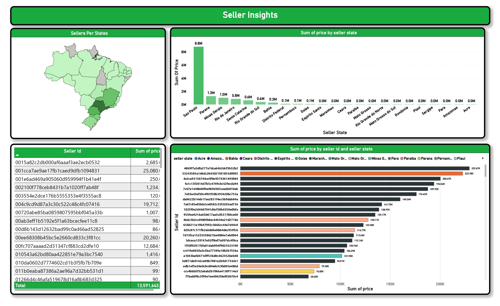
---
### 6. **Product Demand Analysis**

- **Visuals:** Sales by product category, category contribution to revenue.
-  High demand for "Beauty and Health" and "Bed, Bath & Table."

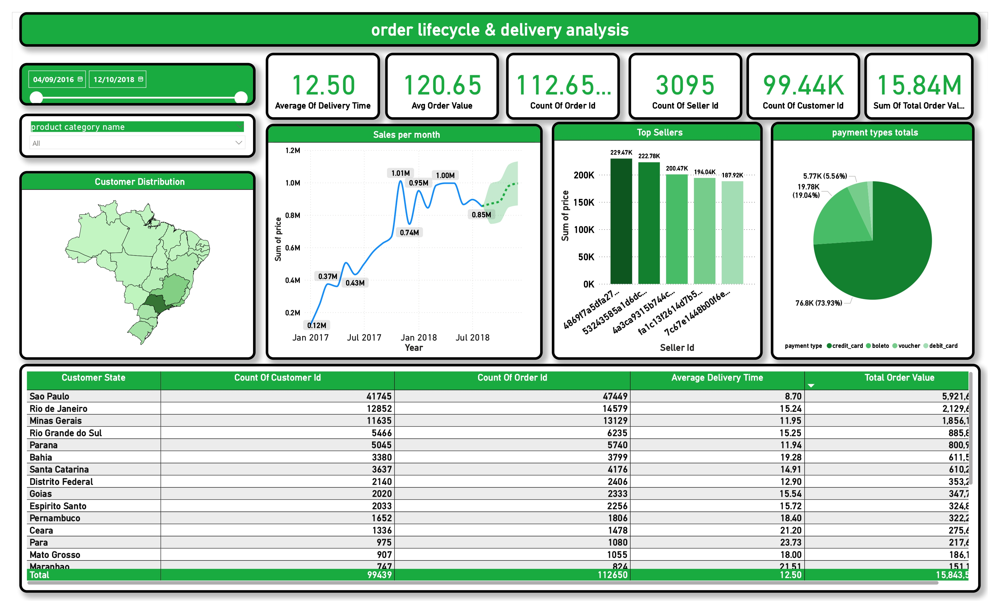

---

## 📊 Key Metrics and Analytical Approach

### Key Metrics:
- **Customer Lifetime Value (CLV):** Identifying long-term customer value.
- **Average Purchase Frequency:** Gauging customer return rates.
- **Average Delivery Time:** Assessing delivery efficiency.
- **Business Volume Metrics:** Customer count, seller count, and total order value.

### Analytical Approach:
- **Time-Series Analysis:** To identify sales trends and peak periods.
- **Customer Segmentation:** Based on location and purchasing habits.
- **Geographical Analysis:** Examining the impact of distance from São Paulo on sales, freight costs, and delivery times.

---

## ✅ Conclusion and Recommendations

### Recommendations:
1. **Targeted Inventory and Marketing:** Focus on high-demand categories during peak periods.
2. **Credit Card Promotions:** Offer rewards for credit card users.
3. **Geographic Expansion:** Consider regional warehouses to reduce delivery times and costs.
4. **Customer Retention Strategies:** Launch loyalty programs and personalized marketing.
5. **Optimized Delivery Scheduling:** Expand capacity during peak order hours.

---

## 📂 Appendix

- **DAX Calculations:** Includes formulas for CLV and average revenue per customer.
- **Data Transformation Documentation:** Details on translations, SQL queries, and cleaning.
- **Additional Visualizations:** Charts for geographical sales, payment methods, and cart abandonment.

---

## 📧 Contact

For more information:  
**Email:** Yousef Emad ([Yousefe2152@gmail.com](mailto:Yousefe2152@gmail.com))  
**LinkedIn:** [Yousef Emad](https://www.linkedin.com/in/yousef-emad-abdelrhman-elkhoudairy)
